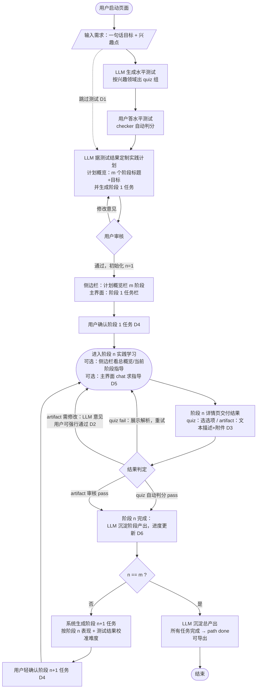
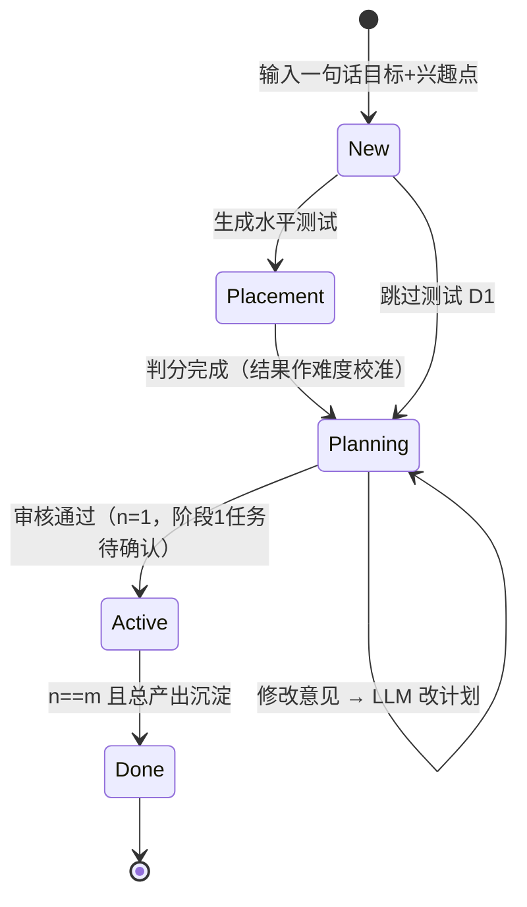
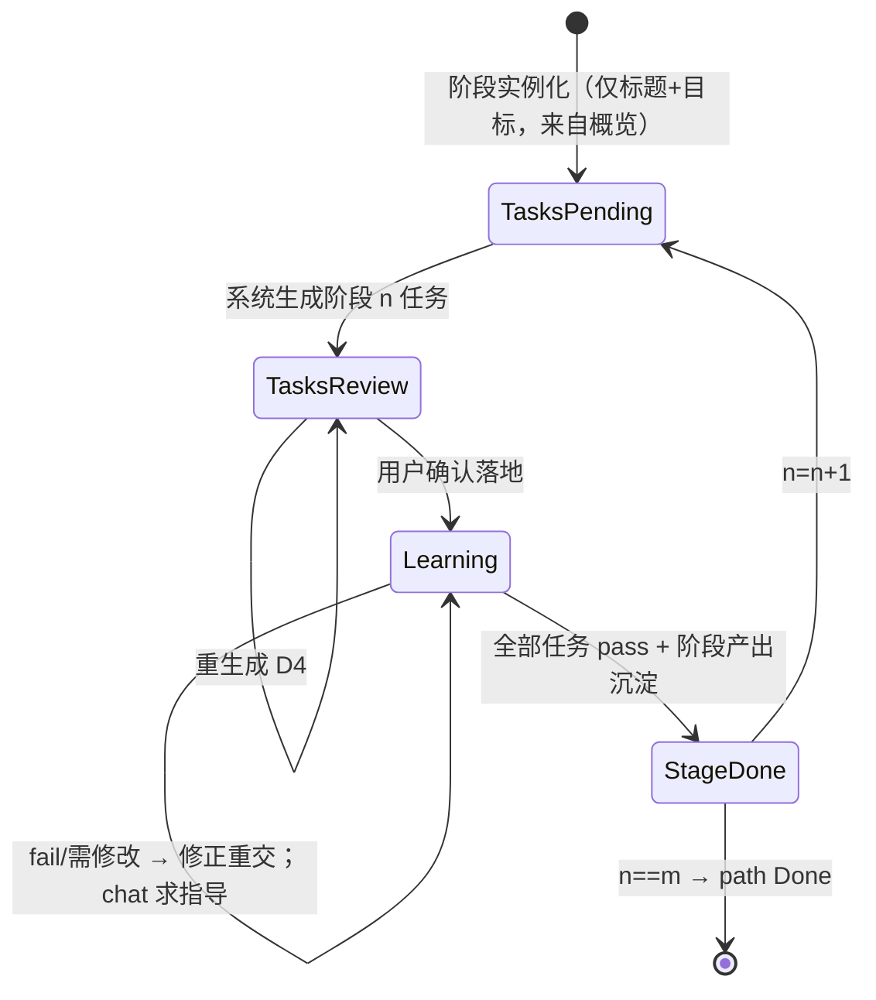
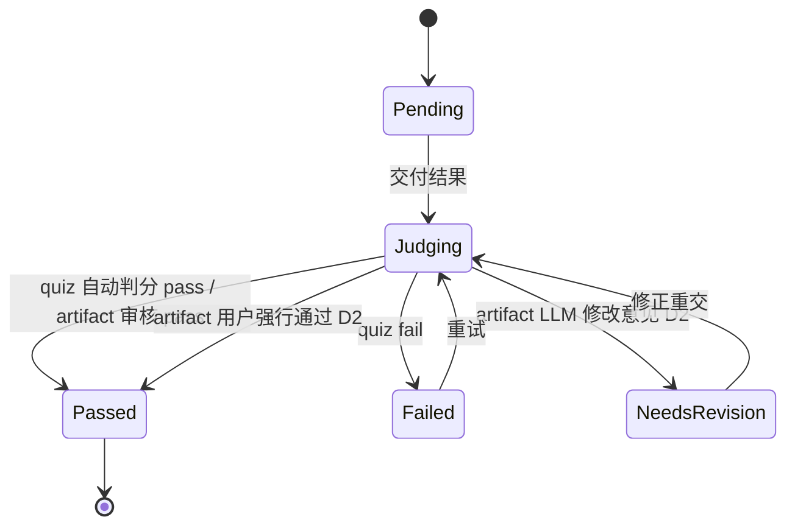

# 产品流程 v2：流程图 + 状态图（可编辑 Mermaid）

- 日期：2026-08-20
- 状态：**定稿**（D1-D6 已裁决 2026-08-20：D1 可跳过 / D2 LLM 建议+用户终裁 / D3 文本+文件上传 / D4 轻确认 / D5 按 task 持久 / D6 自动沉淀）；实施计划见 docs/G3-7-flowv2计划.md
- 阶段：G1 级设计迭代（输入：用户手绘流程图 2026-08-20；底座：PROJECT_BRIEF + G1-方案 v2 + G3-6 已实现部分）
- 编辑方式：Mermaid 文本即源，粘到 mermaid.live / GitHub / Typora 可渲染；改图 = 改本文档

## 1. 完善后的流程图

相对手绘版的完善点：① 补「跳过水平测试」旁路（D1）；② 补阶段 n+1 任务的「用户确认」节点（原则：落地须确认，D4）；③ 判分菱形拆出 quiz/artifact 两支（artifact 走 LLM 审核 + 用户终裁，D2）；④ 补沉淀产出与导出节点；⑤ chat 求指导画为学习态的可选旁路（D5）。

## 2. 状态图（三层：path / stage / task）

### 2.1 Path 级

### 2.2 Stage 级（Active 内，每阶段独立状态机）

### 2.3 Task 级

注：若 D2 裁决「保留纯清单」，artifact 分支退化为现 confirm_acceptance（checklist 全勾 → Passed，无 NeedsRevision 态）。

## 3. 与现有实现（G3-6）的映射

| 流程 v2 节点 | 现有实现 | 变更 |
|---|---|---|
| 输入需求 | POST /goals + 新目标 hero 表单 | 复用 |
| LLM 生成水平测试 | — | 新增：planner.generate_placement_test + 路由 + 答题 UI |
| 水平测试判分 | checker.judge_quiz | 复用判分；新增整卷提交路由 |
| LLM 定制计划（概览+阶段1任务） | planner.generate_candidate_path（一次全树） | 重构：概览与阶段任务分离 |
| 用户审核循环 | 候选编辑 + PUT + activate | 复用（编辑范围视 D4） |
| 侧边栏概览栏 | 三态树 | 扩展：阶段状态（待生成/学习中/完成） |
| 阶段 n+1 任务生成 | 一次全生成 | 重构：增量生成 + 难度校准 |
| chat 求指导 | — | 新增：conversations 表 + 路由 + 主界面 chat 区 |
| quiz 自动判分 | checker + attempts | 复用 |
| artifact 判定 | confirm_acceptance 清单 | 视 D2/D3 重构（提交载体 + LLM 审核） |
| 阶段产出沉淀 | — | 新增：stages.summary + planner.summarize |
| 总产出 / done | complete + export | 扩展：总沉淀 + 导出 |

## 4. 裁决记录 D1-D6（2026-08-20 用户裁决）

| 编号 | 问题 | 裁决 |
|---|---|---|
| D1 | 水平测试可否跳过？ | **可跳过**（跳过 → 难度默认 N1 校准） |
| D2 | artifact 判定权归谁？ | **LLM 建议 + 用户终裁**（可「强行通过」，attempts 证据含双方意见） |
| D3 | artifact 提交载体？ | **文本描述 + 文件上传**（安全约束见实施计划：扩展名白名单/大小上限/uuid 命名/LLM 只读文本摘录） |
| D4 | 阶段 n+1 任务要不要用户确认？ | **轻确认**（列表 + [开始学习]/[重生成]，不逐字段编辑） |
| D5 | chat 求指导范围？ | **按 task 持久化**（conversations 表；只指导不改计划） |
| D6 | 沉淀产出触发方式？ | **自动沉淀**（阶段完成即 LLM 总结存 stage.summary，可刷新重生成） |

## 5. 后端结构要点（定稿；实施细节见 docs/G3-7-flowv2计划.md）

- 新表：`placement_tests`（goal_id, questions json, answers json, graded_at）｜`conversations`（task_id, role, content, ts）
- 列扩展：stages + `status`（pending/review/learning/done）+ `objective` + `summary`｜attempts + `submission`（文本载体）+ `file_name/file_path`（附件元数据）+ `llm_review` + `forced`
- planner 增：generate_placement_test / generate_overview / generate_stage_tasks(n, 校准) / summarize_stage / summarize_all
- checker 增：review_artifact（LLM 审核，D2 建议制）；judge_quiz 复用
- 上传安全红线：扩展名白名单（.md/.txt/.py/.js/.ts/.json/.csv/.log）· ≤1MB · uuid 命名存 data/uploads/ · 原名仅元数据 · LLM 只读前 2 万字符摘录 · 上传目录不静态伺服 · 防穿越
- 前端：首屏三态（水平测试/候选审核/新目标+跳过入口）· 阶段轻确认视图 · chat 侧栏 · 附件上传 UI · 沉淀卡片 · 侧边栏阶段状态化

裁决 D1-D6 → 更新本文档定稿 → 出实施计划（TDD 用例表+步骤）→ 开工令 → 动代码。
